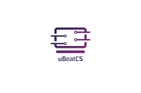

<h1 align="center">
   
  </a>
   
  uBeatCS
   
</h1>

<h4 align="center">An android application that helps UTEP students pass their classes</h4>

## Description
This Android application is designed to help UTEP Computer Science students find resources to pass their classes, resources that are not given to them in class and that can be of great help, such as previous quizzes, coding tutorials, exam reviews.

This project was used as the semester project for the University of Texas at El Paso's CS 4330 Mobile Application Development course in the Fall 2019 semester. 

---

  <a href="#key-features">Key Features</a> |
  <a href="#how-to-use">How To Use</a> |
  <a href="#download">Download</a> |
  <a href="#credits">Credits</a> | 
  <a href="#license">License</a>

## Key Features

* Download files - the user can download the resource files to their device locally.
* Class webpage - the user can view the webpage for that specific class.  
* Upload files - the user can select a file (image or pdf) to the database in order to share with other users.

